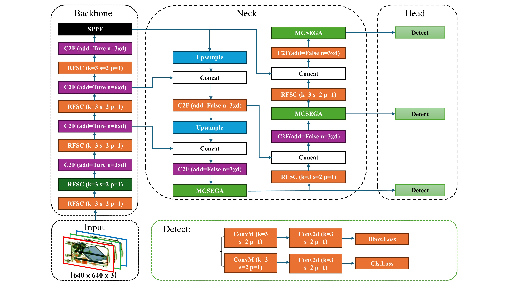
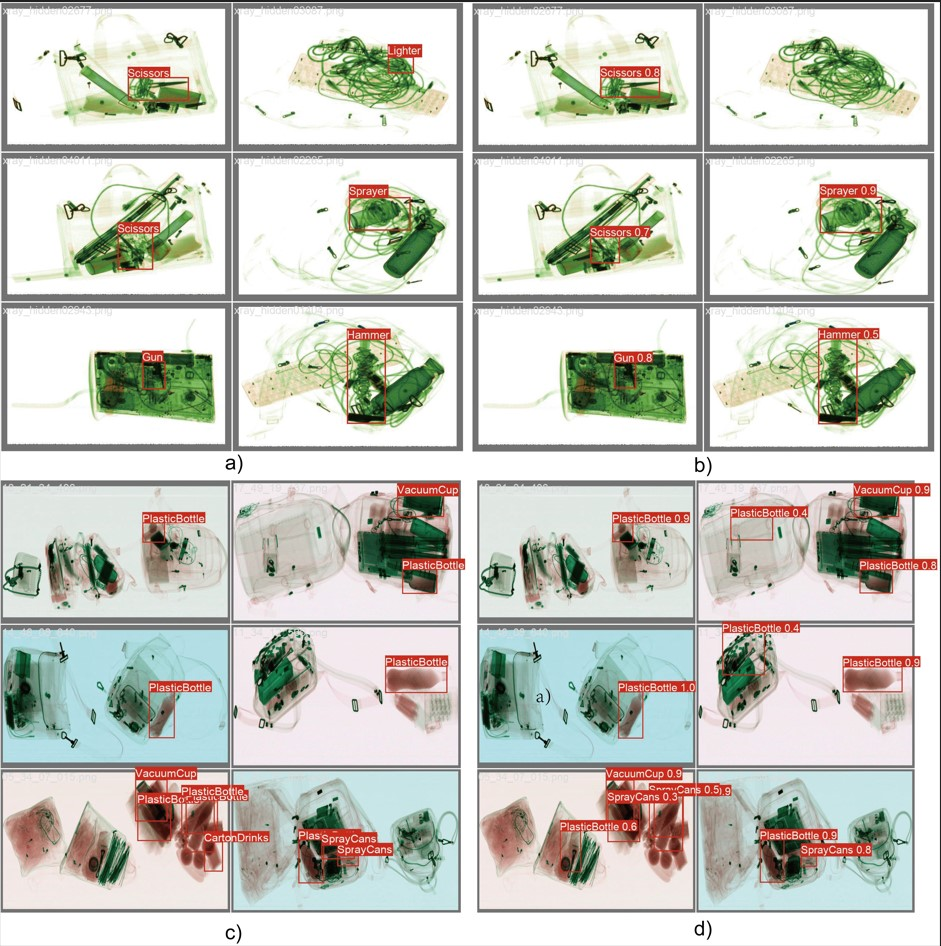

# RMSCNet

 A Multidimensional Spatial Channel Receptive Field Network for Prohibited Item Detection.

## Description
RMSCNet is based on yolov8s design, from the convolution and attention mechanism out of the two aspects, to enhance its detection ability in the X-ray prohibited items, design details see the original paper

## Overall Framework

### Visualization

## Requisities

-`python=3.9`

-`Framework:  PyTorch 2.0.1`

-`CUDA: 11.8`

## Installation

**Git clone RMSCNet**

​		`git clone `

**Install  the required dependencies**

​		In the RMSCNet root directory, open the terminal and run the following command

​		`pip install ultralytics==8.1.34`

​		`pip install -v .`

## **Datasets**

**PIDray dataset**

Your can download PIDray dataset from here.: https://pan.baidu.com/s/1qPUNWYItg08pht0kFn8qxg code: 8vz6

**CLCXray dataset**

Your can download  CLCXray dataset from here:https://pan.baidu.com/share/init?surl=fYwxiyGG8cJndebMO4Bn9A code: clcx

**Dataset tool**

You can use the following tools to convert the data set into the format used by the model

[dataset_tool](https://pan.baidu.com/s/1Mk2uKHFOKKEkWkGmy1mIcQ?pwd=c1zy)

## Main Result

Performance Results of Different Networks on the PIDray Test Set

| Method  | Easy/mAP | Hard/mAP | Hidden/mAP | Model Weights                                                |
| :-----: | :------: | :------: | :--------: | ------------------------------------------------------------ |
| RMSCNet |  83.16   |  79.97   |   62.86    | [Checkpoint](https://pan.baidu.com/s/1enYE-uwourwncz7dFeCN3g?pwd=jykz) |

CLCXray Dataset

| Method  | mAP^0.5^ | mAP^0.95^ | mAP  |                        Model Weights                         |
| :-----: | :------: | :-------: | :--: | :----------------------------------------------------------: |
| RMSCNet |  72.01   |   70.39   | 62.2 | [Checkpoint](https://pan.baidu.com/s/1m4Og0iiwahji-zBsBe5LYA?pwd=pkea) |

## Train

First Download the preprocess dataset and change the dataset path  and Run

​		`python */RMSCNet/model/run/start/train.py`

## Evaluation

Download the preprocessed dataset and Modify your dataset path and run

​		`python */RMSCNet/model/run/start/val.py`

## Acknowledgement

​	RMSCNet is built based on [Ultralytics](https://github.com/ultralytics/ultralytics/releases/tag/v8.3.20).

